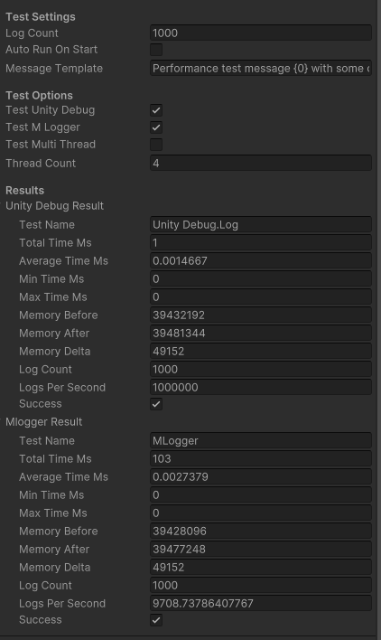
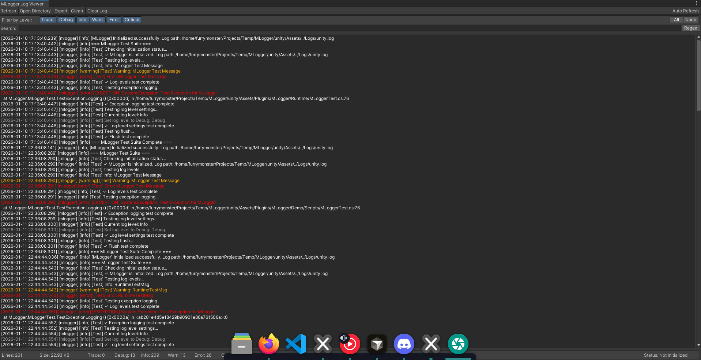

# MLogger

基于 [spdlog](https://github.com/gabime/spdlog) 的高性能 Unity 日志插件，提供跨平台的原生日志记录功能。



## 主要特性




- 高性能 - 基于 spdlog 的异步日志系统，对游戏性能影响极小
- 文件滚动 - 自动管理日志文件大小和数量，防止日志文件过大
- 多平台支持 - Windows、Linux、macOS、Android、iOS
- 灵活配置 - 支持日志级别、文件路径、异步模式等配置
- 编辑器工具 - Unity Editor 集成配置界面和日志查看器
- 自动初始化 - 支持运行时自动初始化，无需手动调用
- Unity 集成 - 无缝集成 Unity 日志系统，自动捕获 Debug.Log/Error/Warning

## 支持的平台

- Windows - x86, x86_64
- Linux - x86, x86_64
- macOS - x86_64, arm64
- Android - armeabi-v7a, arm64-v8a, x86, x86_64
- iOS - arm64

## 项目结构

```
MLogger/
├── native/              # C++ 原生层（基于 spdlog）
│   ├── src/            # 源代码
│   │   ├── core/       # 核心日志管理器
│   │   ├── bridge/     # C 接口桥接层
│   │   └── utils/      # 工具类（路径和字符串处理工具）
│   ├── tests/          # Native 层测试套件
│   └── external/       # 第三方依赖（spdlog）
├── unity/              # Unity C# 插件层
│   └── Assets/
│       └── Plugins/
│           └── MLogger/
│               ├── Runtime/    # 运行时脚本
│               ├── Editor/     # 编辑器工具
│               └── External/   # 原生库文件
└── scripts/            # 构建和自动化脚本
    └── compile/        # 编译脚本
```

## 构建

### 前置要求

- Python 3.6+
- CMake 3.20+
- 对应平台的编译工具链（如 Visual Studio、GCC、Xcode 等）

### 构建选项

构建脚本支持多个选项：

```bash
# 强制清理构建（移除 CMake 缓存）
python scripts/compile/build.py --platform linux --clean

# 构建并运行测试
python scripts/compile/build.py --platform linux --test

# 失败时重试
python scripts/compile/build.py --platform linux --retry 3
```

### 构建所有平台

```bash
python scripts/compile/build.py --all
```

### 构建特定平台

```bash
# Linux
python scripts/compile/build.py --platform linux

# Windows
python scripts/compile/build.py --platform windows

# macOS
python scripts/compile/build.py --platform macos

# Android
python scripts/compile/build.py --platform android

# iOS
python scripts/compile/build.py --platform ios
```

### 构建特定架构

```bash
python scripts/compile/build.py --platform linux --arch x86_64
```

构建完成后，库文件会自动复制到 `unity/Assets/Plugins/MLogger/External/` 对应平台目录。

## 使用

### 基本使用

MLogger 支持自动初始化，只需在 Unity Editor 中配置即可：

1. 打开 **Edit > Project Settings > MLogger**
2. 配置日志路径、文件大小、日志级别等
3. 运行游戏，日志会自动记录到文件

### 代码示例

```csharp
using MLogger;
using UnityEngine;

public class Example : MonoBehaviour
{
    void Start()
    {
        // 使用 Unity 标准日志接口，MLogger 会自动捕获
        Debug.Log("这是一条信息日志");
        Debug.LogWarning("这是一条警告日志");
        Debug.LogError("这是一条错误日志");
        
        // 检查初始化状态
        if (MLoggerManager.IsInitialized)
        {
            Debug.Log($"日志文件路径: {MLoggerManager.CurrentConfig.logPath}");
        }
        
        // 手动设置日志级别
        MLoggerManager.SetLogLevel(LogLevel.Warning);
        
        // 刷新日志缓冲区
        MLoggerManager.Flush();
    }
}
```

### 手动初始化

如果需要手动控制初始化：

```csharp
var config = new MLoggerConfig
{
    logPath = "Logs/game.log",
    maxFileSize = 10 * 1024 * 1024,  // 10MB
    maxFiles = 5,
    asyncMode = true,
    minLogLevel = LogLevel.Info
};

MLoggerManager.Initialize(config);
```

## 配置说明

### 配置项

- **logPath** - 日志文件路径（默认：平台特定路径）
- **maxFileSize** - 单个日志文件最大大小（默认：10MB）
- **maxFiles** - 保留的日志文件数量（默认：5）
- **asyncMode** - 是否使用异步模式（默认：true）
- **threadPoolSize** - 异步模式线程池大小（默认：2）
- **minLogLevel** - 最小日志级别（默认：Info）
- **autoInitialize** - 是否自动初始化（默认：true）
- **alsoLogToUnity** - 是否同时输出到 Unity Console（默认：true）

### 日志级别

- `Trace` - 最详细的日志
- `Debug` - 调试信息
- `Info` - 一般信息
- `Warning` - 警告
- `Error` - 错误
- `Critical` - 严重错误

## 编辑器工具

### 配置界面

在 **Edit > Project Settings > MLogger** 中可以：

- 配置日志路径、文件大小、数量
- 设置日志级别和异步模式
- 查看运行时状态
- 一键打开日志目录
- 手动刷新日志缓冲区

### 日志查看器

在 **Window > MLogger > Log Viewer** 中可以：

- 实时查看日志文件内容
- **文件选择** - 在多个日志文件之间切换（包括滚动后的历史文件）
- **级别过滤** - 按日志级别过滤（Trace/Debug/Info/Warn/Error/Critical）
- **高级搜索** - 使用关键词或正则表达式搜索
- **语法高亮** - 不同日志级别使用不同颜色显示，提高可读性
- **自动刷新** - 按可配置的时间间隔自动刷新日志内容
- **统计信息** - 查看日志统计（总行数、各级别数量、文件大小）
- **导出功能** - 将过滤后的日志导出为文本或 CSV 文件
- **清理工具** - 按大小、时间或数量清理日志文件

## 测试

项目包含完整的测试套件：

### Native 层测试

位于 `native/tests/`，包括：
- **基础测试** (`test_mlogger.cpp`) - 核心功能测试
- **边界测试** (`test_boundary.cpp`) - 边界条件和极端配置测试
- **错误处理测试** (`test_error_handling.cpp`) - 无效路径、权限问题等
- **压力测试** (`test_stress.cpp`) - 高频日志输出和并发测试
- **内存测试** (`test_memory.cpp`) - 内存操作和边缘情况测试

运行测试：
```bash
python scripts/compile/build.py --platform linux --test
```

### Unity 层测试

测试脚本位于 `unity/Assets/Plugins/MLogger/Demo/`，用于运行时测试。

## 示例

项目包含完整的示例场景和测试脚本，位于 `unity/Assets/Plugins/MLogger/Demo/`。

## 许可证

本项目使用与 spdlog 相同的许可证。详见 [LICENSE](native/external/spdlog/LICENSE) 文件。
