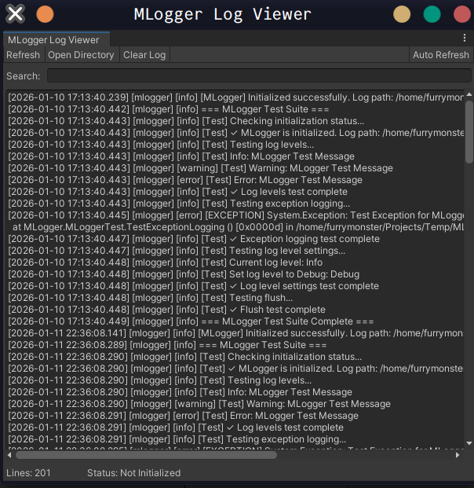
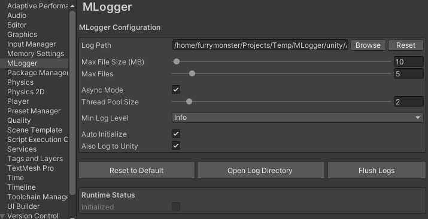

# MLogger

High-performance Unity logging plugin based on [spdlog](https://github.com/gabime/spdlog), providing cross-platform native logging functionality.





## Features

- High Performance - Asynchronous logging system based on spdlog with minimal impact on game performance
- File Rotation - Automatic log file size and count management to prevent oversized log files
- Multi-Platform - Supports Windows, Linux, macOS, Android, and iOS
- Flexible Configuration - Configurable log levels, file paths, async mode, and more
- Editor Tools - Integrated Unity Editor configuration interface and log viewer
- Auto Initialization - Supports automatic runtime initialization without manual calls
- Unity Integration - Seamless integration with Unity logging system, automatically captures Debug.Log/Error/Warning

## Supported Platforms

- Windows - x86, x86_64
- Linux - x86, x86_64
- macOS - x86_64, arm64
- Android - armeabi-v7a, arm64-v8a, x86, x86_64
- iOS - arm64

## Project Structure

```
MLogger/
├── native/              # C++ native layer (based on spdlog)
│   ├── src/            # Source code
│   │   ├── core/       # Core logger manager
│   │   ├── bridge/     # C interface bridge
│   │   └── utils/      # Utility classes
│   └── external/       # Third-party dependencies (spdlog)
├── unity/              # Unity C# plugin layer
│   └── Assets/
│       └── Plugins/
│           └── MLogger/
│               ├── Runtime/    # Runtime scripts
│               ├── Editor/     # Editor tools
│               └── External/   # Native library files
└── scripts/            # Build and automation scripts
    └── compile/        # Compilation scripts
```

## Building

### Prerequisites

- Python 3.6+
- CMake 3.20+
- Platform-specific build toolchain (Visual Studio, GCC, Xcode, etc.)

### Build All Platforms

```bash
python scripts/compile/build.py --all
```

### Build Specific Platform

```bash
# Linux
python scripts/compile/build.py --platform linux

# Windows
python scripts/compile/build.py --platform windows

# macOS
python scripts/compile/build.py --platform macos

# Android
python scripts/compile/build.py --platform android

# iOS
python scripts/compile/build.py --platform ios
```

### Build Specific Architecture

```bash
python scripts/compile/build.py --platform linux --arch x86_64
```

After building, library files will be automatically copied to `unity/Assets/Plugins/MLogger/External/` for the corresponding platform.

## Usage

### Basic Usage

MLogger supports automatic initialization. Simply configure it in Unity Editor:

1. Open **Edit > Project Settings > MLogger**
2. Configure log path, file size, log level, etc.
3. Run the game, logs will be automatically recorded to files

### Code Example

```csharp
using MLogger;
using UnityEngine;

public class Example : MonoBehaviour
{
    void Start()
    {
        // Use Unity standard logging interface, MLogger will automatically capture
        Debug.Log("This is an info log");
        Debug.LogWarning("This is a warning log");
        Debug.LogError("This is an error log");
        
        // Check initialization status
        if (MLoggerManager.IsInitialized)
        {
            Debug.Log($"Log file path: {MLoggerManager.CurrentConfig.logPath}");
        }
        
        // Manually set log level
        MLoggerManager.SetLogLevel(LogLevel.Warning);
        
        // Flush log buffer
        MLoggerManager.Flush();
    }
}
```

### Manual Initialization

If you need manual control over initialization:

```csharp
var config = new MLoggerConfig
{
    logPath = "Logs/game.log",
    maxFileSize = 10 * 1024 * 1024,  // 10MB
    maxFiles = 5,
    asyncMode = true,
    minLogLevel = LogLevel.Info
};

MLoggerManager.Initialize(config);
```

## Configuration

### Configuration Options

- **logPath** - Log file path (default: platform-specific path)
- **maxFileSize** - Maximum size of a single log file (default: 10MB)
- **maxFiles** - Number of log files to keep (default: 5)
- **asyncMode** - Whether to use async mode (default: true)
- **threadPoolSize** - Thread pool size for async mode (default: 2)
- **minLogLevel** - Minimum log level (default: Info)
- **autoInitialize** - Whether to auto-initialize (default: true)
- **alsoLogToUnity** - Whether to also output to Unity Console (default: true)

### Log Levels

- `Trace` - Most detailed logs
- `Debug` - Debug information
- `Info` - General information
- `Warning` - Warnings
- `Error` - Errors
- `Critical` - Critical errors

## Editor Tools

### Configuration Interface

In **Edit > Project Settings > MLogger**, you can:

- Configure log path, file size, and count
- Set log level and async mode
- View runtime status
- Open log directory with one click
- Manually flush log buffer

### Log Viewer

In **Window > MLogger > Log Viewer**, you can:

- View log file content in real-time
- Search and filter logs
- Auto-refresh functionality
- View log statistics

## Examples

The project includes complete example scenes and test scripts located in `unity/Assets/Plugins/MLogger/Demo/`.

## License

This project uses the same license as spdlog. See the [LICENSE](native/external/spdlog/LICENSE) file for details.
